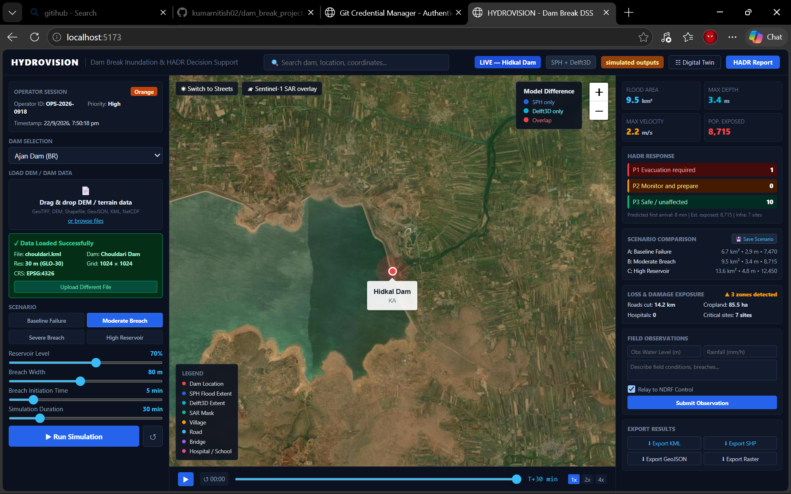

# 🌊 HYDROVISION

### Dam Break Inundation Modelling & HADR Decision Support System

[](#)
[](#)
[](#)
[](#)

**HYDROVISION** is a dam-break inundation modelling and **HADR
(Humanitarian Assistance and Disaster Relief) decision-support**
platform developed for **Smart India Hackathon (SIH) 2026**, under
**Problem Statement #26161 --- "Dam Break Inundation Modelling Using
Hydrodynamic Modelling of any River."**

The platform brings together hydrodynamic modelling, terrain/DEM data,
geospatial visualization, satellite-data overlays, scenario analysis,
and exposure assessment in a unified dashboard to help users understand
potential flood impacts and support emergency planning.

------------------------------------------------------------------------

## 🏆 SIH 2026

  -----------------------------------------------------------------------
  Detail                              Information
  ----------------------------------- -----------------------------------
  **Event**                           Smart India Hackathon 2026

  **Problem Statement**               #26161

  **Problem Statement Title**         Dam Break Inundation Modelling
                                      Using Hydrodynamic Modelling of any
                                      River

  **Team Name**                       Sensie's

  **Team ID**                         140366

  **Institute**                       Lamrin Tech Skills University

  **Solution Name**                   HYDROVISION
  -----------------------------------------------------------------------

------------------------------------------------------------------------

## 📸 Project Preview

> Add the dashboard screenshot to
> `screenshots/hydrovision-dashboard.png` in this repository.



The dashboard provides a single operational view of dam selection,
terrain/DEM input, flood scenarios, inundation visualization, exposure
indicators, HADR response levels, and export options.

------------------------------------------------------------------------

## 🎯 Problem

A dam-break event can rapidly alter river flow and cause flooding across
downstream regions. Effective response requires more than simply
estimating water depth: decision-makers may need to understand the
**spatial extent of inundation, flood depth, flow velocity, exposed
population, roads, agricultural areas, hospitals, schools, and other
critical infrastructure**.

Traditional workflows can involve multiple datasets, modelling tools,
GIS software, and separate analysis steps. This can make scenario
exploration and rapid interpretation more difficult during
time-sensitive disaster-response planning.

### Our objective

HYDROVISION aims to provide an integrated environment where users can:

-   Model potential dam-break inundation scenarios.
-   Visualize flood extent on an interactive map.
-   Work with DEM/terrain and dam-related geospatial data.
-   Compare modelling outputs where available.
-   Assess population and infrastructure exposure.
-   Identify areas requiring different levels of response.
-   Export geospatial results for further analysis and operational use.

------------------------------------------------------------------------

## 💡 Solution Overview

HYDROVISION combines **hydrodynamic simulation, geospatial processing,
remote-sensing overlays, and decision-support visualization** into one
web-based workflow.

### Core workflow

``` text
Dam / River Data
       │
       ▼
DEM / Terrain Data ───────┐
                          │
                          ▼
                 Hydrodynamic Modelling
                          │
             ┌────────────┴────────────┐
             ▼                         ▼
      Flood Extent                Depth / Velocity
             │                         │
             └────────────┬────────────┘
                          ▼
                 Geospatial Analysis
                          │
        ┌─────────────────┼─────────────────┐
        ▼                 ▼                 ▼
   Population         Infrastructure    Agriculture
    Exposure             Exposure          Exposure
        │                 │                 │
        └─────────────────┼─────────────────┘
                          ▼
                HADR Decision Support
                          │
                          ▼
              Visualization & Export
```

------------------------------------------------------------------------

## ✨ Key Features

### 🌊 1. Dam-Break Scenario Modelling

Users can configure and explore different dam-break scenarios, including
parameters such as:

-   Reservoir level
-   Breach width
-   Breach initiation time
-   Simulation duration
-   Scenario severity

The interface supports scenario-based comparison to examine how changing
assumptions can affect predicted inundation.

------------------------------------------------------------------------

### 🗺️ 2. Interactive Flood Visualization

The dashboard provides map-based visualization of:

-   Dam location
-   Flood/inundation extent
-   Model-result overlays
-   Roads
-   Bridges
-   Hospitals and schools
-   Other relevant spatial layers

Users can interact with the map while reviewing simulation outputs and
exposure indicators.

------------------------------------------------------------------------

### 🛰️ 3. Remote-Sensing / SAR Overlay

HYDROVISION includes support for satellite-derived visualization such as
**Sentinel-1 SAR overlays**, allowing users to compare modelled flood
information with available remote-sensing information.

------------------------------------------------------------------------

### 🏔️ 4. DEM & Terrain Data

The platform supports terrain-data workflows using DEM/geospatial
inputs.

Supported data workflows can include formats such as:

-   GeoTIFF / DEM
-   GeoJSON
-   KML
-   NetCDF
-   Other project-supported geospatial datasets

------------------------------------------------------------------------

### 🔬 5. Model Comparison

The interface can present comparative flood modelling outputs,
including:

-   SPH-based results
-   Delft3D-based results
-   Overlapping model extents

This allows users to visually inspect differences between available
modelling approaches.

------------------------------------------------------------------------

### 🚨 6. HADR Decision Support

HYDROVISION translates analysed flood impacts into a response-oriented
view.

The dashboard can organize exposed areas into response categories such
as:

-   **P1 --- Evacuation required**
-   **P2 --- Monitor and prepare**
-   **P3 --- Safe / unaffected**

This provides a simplified operational view for disaster-response
planning.

> These categories are decision-support indicators and should be
> interpreted alongside validated modelling results and official
> emergency-management procedures.

------------------------------------------------------------------------

### 👥 7. Population Exposure Analysis

The platform provides indicators related to potentially exposed
population and can help identify areas where evacuation planning may
require additional attention.

------------------------------------------------------------------------

### 🏥 8. Infrastructure & Loss/Damage Exposure

HYDROVISION can analyse potential impacts on spatial assets such as:

-   Roads
-   Bridges
-   Hospitals
-   Schools
-   Critical sites
-   Agricultural/cropland areas

The dashboard can summarize exposed assets and affected areas for
scenario analysis.

------------------------------------------------------------------------

### 📊 9. Scenario Comparison

Multiple scenarios can be compared using indicators such as:

-   Flood area
-   Maximum depth
-   Potential population exposure

This helps users understand how different breach/reservoir assumptions
change the modelled outcome.

------------------------------------------------------------------------

### 📤 10. Geospatial Result Export

The interface provides export options for analysis and sharing,
including formats such as:

-   KML
-   SHP
-   GeoJSON
-   Raster outputs

------------------------------------------------------------------------

### ▶️ 11. Simulation Playback

Simulation results can be explored over time using the dashboard
playback controls, helping users visualize how the inundation develops
during the simulated period.

------------------------------------------------------------------------

## 🧰 Technology Stack

### Frontend

-   React
-   JavaScript
-   HTML5
-   CSS
-   Vite
-   Interactive map visualization

### Backend / API

-   Python
-   FastAPI
-   Uvicorn
-   REST-style API workflows

### Scientific & Geospatial Computing

-   NumPy
-   Pandas
-   GeoPandas
-   Rasterio
-   Shapely
-   Matplotlib

### Remote Sensing / External Data

-   Google Earth Engine API
-   Sentinel-1 SAR data workflows
-   DEM / terrain datasets

### Data Formats

-   CSV
-   GeoJSON
-   KML
-   Shapefile
-   GeoTIFF
-   NetCDF

------------------------------------------------------------------------

## 📂 Project Structure

The repository is organized around the backend, frontend, modelling
utilities, datasets, and generated project outputs.

``` text
dam_break_project/
│
├── frontend/
│   ├── public/
│   ├── src/
│   ├── package.json
│   └── ...
│
├── *.py
├── Dams.csv
├── requirements.txt
├── README.md
├── .gitignore
│
├── simulation_outputs/
├── output_Bhakra_Dam/
├── output_ajan_dam/
│
└── ...
```

> The exact contents may evolve as the project continues to be
> developed.

------------------------------------------------------------------------

## ⚙️ Installation

### Prerequisites

Make sure the following are installed:

-   **Python 3.10+**
-   **Node.js 18+**
-   **npm**
-   Git

Clone the repository:

``` bash
git clone https://github.com/kumarnitish02/dam_break_project.git
cd dam_break_project
```

------------------------------------------------------------------------

## 🐍 Backend Setup

Create a virtual environment:

### Windows

``` powershell
python -m venv .venv
.venv\Scripts\activate
```

### Linux / macOS

``` bash
python3 -m venv .venv
source .venv/bin/activate
```

Install Python dependencies:

``` bash
pip install -r requirements.txt
```

The main Python dependencies include:

``` text
fastapi
uvicorn
python-multipart
numpy
pandas
geopandas
rasterio
shapely
matplotlib
requests
earthengine-api
```

------------------------------------------------------------------------

## ⚛️ Frontend Setup

Move into the frontend directory:

``` bash
cd frontend
```

Install dependencies:

``` bash
npm install
```

Start the development server:

``` bash
npm run dev
```

Open the local development URL shown by Vite, commonly:

``` text
http://localhost:5173
```

------------------------------------------------------------------------

## ▶️ Running the Backend

The exact backend entry point depends on the current project
configuration. If the FastAPI application is exposed through an `app`
object, a typical command is:

``` bash
uvicorn <module_name>:app --reload
```

Replace `<module_name>` with the Python module containing the FastAPI
application.

------------------------------------------------------------------------

## 📥 Input Data

HYDROVISION is designed to work with combinations of dam, terrain,
river, and geospatial datasets.

Typical inputs may include:

  Data                    Purpose
  ----------------------- ---------------------------------
  Dam data                Dam identification and location
  DEM / GeoTIFF           Terrain/elevation information
  River/geospatial data   River and surrounding geography
  KML / GeoJSON           Spatial boundaries and features
  Satellite/SAR data      Remote-sensing comparison
  CSV datasets            Dam and attribute information

The quality of the modelling output depends heavily on the quality,
resolution, coordinate reference system, and completeness of the input
datasets.

------------------------------------------------------------------------

## 📊 Outputs

Depending on the selected workflow and scenario, HYDROVISION can
provide:

-   Flood/inundation extent
-   Maximum water depth
-   Flow velocity indicators
-   Population exposure
-   Infrastructure exposure
-   Agricultural exposure
-   Critical-site exposure
-   Scenario comparisons
-   HADR response indicators
-   Exportable geospatial layers

------------------------------------------------------------------------

## 🧪 Example Scenario Workflow

A typical workflow can be:

``` text
1. Select a dam
        ↓
2. Load DEM / terrain data
        ↓
3. Configure reservoir and breach parameters
        ↓
4. Select simulation scenario
        ↓
5. Run the simulation/model
        ↓
6. Visualize inundation
        ↓
7. Analyse depth, velocity and flood area
        ↓
8. Assess population & infrastructure exposure
        ↓
9. Review HADR response indicators
        ↓
10. Export results
```

------------------------------------------------------------------------

## 🛡️ Disaster-Response Use Case

HYDROVISION is intended as a **decision-support and visualization
system**, not as a replacement for official emergency-management
authorities or validated operational flood-warning systems.

Potential users and stakeholders could include:

-   Disaster-management authorities
-   Dam/reservoir operators
-   Hydrologists
-   GIS analysts
-   Emergency-response teams
-   Local administration
-   Researchers and academic institutions
-   Infrastructure planners

------------------------------------------------------------------------

## 🚀 Future Scope

Potential future enhancements include:

-   Real-time hydrological and weather-data integration
-   Improved high-resolution hydrodynamic modelling
-   Automated satellite-based flood validation
-   More detailed infrastructure vulnerability modelling
-   Multi-river and multi-dam analysis
-   Automated evacuation-route planning
-   Mobile-friendly emergency interfaces
-   Real-time alerts and notifications
-   Advanced 3D flood visualization
-   Improved uncertainty analysis
-   Cloud-based large-scale simulations
-   Historical-event calibration and validation
-   AI-assisted scenario analysis

------------------------------------------------------------------------

## ⚠️ Limitations

Flood modelling is sensitive to input data and modelling assumptions.
Results can vary based on:

-   DEM resolution and accuracy
-   Reservoir conditions
-   Breach geometry
-   Breach initiation assumptions
-   Boundary conditions
-   River geometry
-   Roughness parameters
-   Available infrastructure/population datasets
-   Model calibration and validation

Therefore, outputs should be **validated against appropriate
hydrological, geospatial, and field information before operational
use**.

------------------------------------------------------------------------

## 👥 Team Sensie's

### Smart India Hackathon 2026 --- Team ID 140366

  Member
  ------------------------
  **Nitish Kumar**
  **Dimple Pawa**
  **Nitin Tomar**
  **Nitin Sharma**
  **Satyam Kumar Gupta**
  **Bathula Nikhilesh**

**Institute:** Lamrin Tech Skills University

------------------------------------------------------------------------

## 📌 Project Information

**Project:** HYDROVISION\
**Domain:** Disaster Management / Hydrology / Geospatial Technology\
**Event:** Smart India Hackathon 2026\
**Problem Statement:** 26161\
**Problem Statement:** Dam Break Inundation Modelling Using Hydrodynamic
Modelling of any River\
**Team:** Sensie's\
**Team ID:** 140366\
**Institute:** Lamrin Tech Skills University

------------------------------------------------------------------------

## 🤝 Contributing

This project was developed as part of **Smart India Hackathon 2026**.

For development contributions:

1.  Fork the repository.
2.  Create a feature branch.

``` bash
git checkout -b feature/your-feature
```

3.  Make your changes.
4.  Test the changes locally.
5.  Commit your changes.

``` bash
git add .
git commit -m "Add your feature"
```

6.  Push the branch.

``` bash
git push origin feature/your-feature
```

7.  Open a Pull Request.

------------------------------------------------------------------------

## 📜 License

This project was developed for **Smart India Hackathon 2026**.

If this repository is intended for public reuse, distribution, or
deployment beyond the hackathon, add an appropriate open-source license
after confirming the team's preferred licensing terms.

------------------------------------------------------------------------

## ⭐ Acknowledgement

We would like to acknowledge **Smart India Hackathon** and **Lamrin Tech
Skills University** for providing the platform and academic environment
to develop this solution.

------------------------------------------------------------------------

## 🌊 HYDROVISION

> **Model the flood. Visualize the impact. Support the response.**

Built with teamwork, geospatial technology, hydrodynamic modelling, and
a focus on disaster-response decision support.
